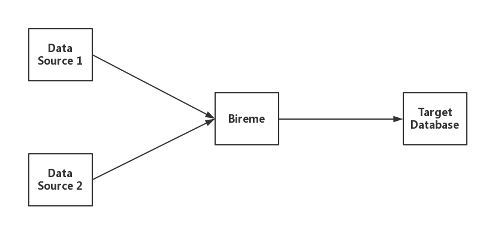
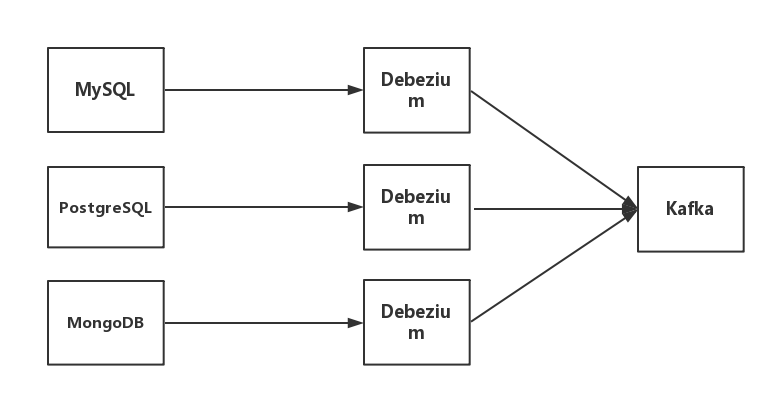
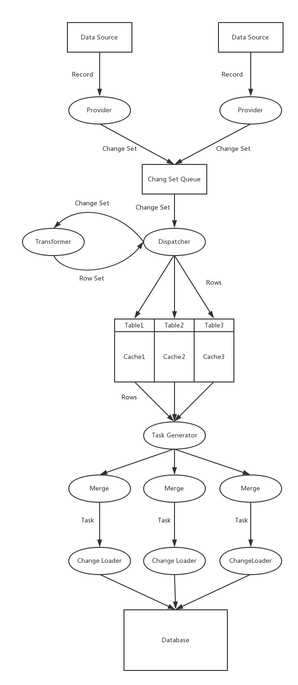
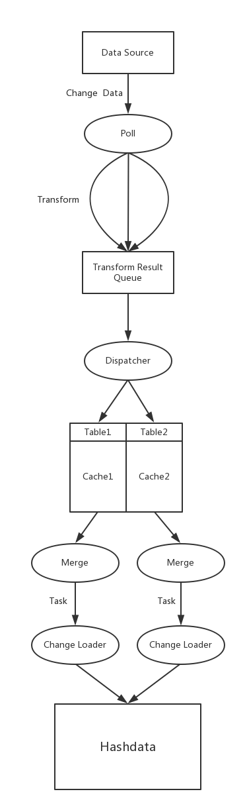

# bireme

[](https://travis-ci.org/HashDataInc/bireme)

[中文文档](README_zh-cn.md)

[Getting Started Guide](docs/bireme_guide.md)

Bireme is an incremental synchronization tool for the Greenplum / HashData data warehouse. It currently supports MySQL, PostgreSQL and MongoDB data sources.

[Greenplum](http://greenplum.org/) is an advanced, fully functional open source data warehouse that provides powerful and fast analysis of the amount of petabyte data. It is uniquely oriented for large data analysis and is supported by the world's most advanced cost-based query optimizer. It can provide high query performance over large amounts of data.

[HashData](http://www.hashdata.cn) is a flexible cloud data warehouses built based on Greenplum.

Bireme uses DELETE + COPY to synchronize the modification records of the data source to Greenplum / HashData. This mode is faster and better than INSERT + UPDATE + DELETE.

Features and Constraints:

* Using small batch loading to enhance the performance of data synchronization. The default load delay time is 10 seconds.
* All tables must have primary keys in the target database.

## 1.1 Data Flow



Bireme supports synchronization work of multiple data sources. It can simultaneously read records from multiple data sources in parallel, and load records to the target database.

## 1.2 Data Source

### 1.2.1 Maxwell + Kafka 

Maxwell + Kafka is a data source type that bireme currently supports. The structure is as follows:


* [Maxwell](http://maxwells-daemon.io/) is an application that reads MySQL binlogs and writes row updates to Kafka as JSON.

### 1.2.2 Debezium + Kafka

Debezium + Kafka is another data source type that bireme currently supports. The structure is as follows:

 

* [Debezium](http://debezium.io/) is a distributed platform that turns your existing databases into event streams, so that  applications can see and respond immediately to each row-level change in the databases. 

## 1.3 How does bireme work

Bireme reads records from the data source, delivers them into separate pipelines. In each pipeline, bireme converts them into internal format and caches them. When the cached records reaches a certain amount, they are merged into a task. Each task contains two collections, *delete*  collection and *insert* collection. It finally updates the records to the target database.

Each data source may have several pipelines. For maxwell, each Kafka partition corresponds to a pipeline and for debezium, each Kafka topic corresponds to a pipeline.



The following picture depicts how change data is processed in a pipeline.



## 1.4 Introduction to configuration files

The configuration files consist of two parts:

* Basic configuration file: The default is **config.properties**, which contains the basic configuration of bireme.
* Table mapping file: **\<source_name\>.properties**. Each data source corresponds to a file, which specifies the table to be synchronized and the corresponding table in the target database. \<Source_name\> is specified in the config.properties file.

### 1.4.1 config.properties

**Required parameters**

|Parameters|Description|
|:---:|:---:|
|target.url|Address of the target database. Format:<br>jdbc:postgresql://\<ip\>:\<port\>/\<database\>|
|target.user|The user name used to connect to the target database|
|target.passwd|The password used to connect to the target database|
|data.source|Specify the data source, which is \<source_name\>, with multiple data sources separated by commas, ignoring whitespace|
|\<source_name\>.type|Specify the type of data source, for example maxwell|

**Note:** The data source name is just a symbol for convinence. It can be modified as needed.

**Parameters for Maxwell data source**

|Parameters|Description|
|:---:|:---:|
|\<source_name\>.kafka.server|Kafka address. Format:<br>\<ip\>:\<port\>|
|\<source_name\>.kafka.topic|Corresponding topic of data source|
|\<source_name\>.kafka.groupid|Kafka consumer group id. Default value is *bireme*|

**Parameters for Debezium data source**

|Parameters|Description|
|:---:|:---:|
|\<source_name\>.kafka.server|Kafka address. Format:<br>\<ip\>:\<port\>|
|\<source_name\>.kafka.groupid|Kafka consumer group id. Default value is *bireme*|
|\<source_name\>.kafka.namespace|Debezium's name.|

**Other parameters**

|Parameters|Description|Default|
|:---:|:---:|:---:|
|pipeline.thread_pool.size|Thread pool size for Pipeline|5|
|transform.thread_pool.size|Thread pool size for Transform|10|
|merge.thread_pool.size|Thread pool size for Merge|10|
|merge.interval|Maxmium interval between Merge in milliseconds|10000|
|merge.batch.size|Maxmium number of Row in one Merge|50000|
|loader.conn_pool.size|Number of connections to target database, which is less or equal to the number of Change Loaders|10|
|loader.task_queue.size|The length of task queue in each Change Loader|2|
|metrics.reporter|Bireme specifies two monitoring modes, consolo or jmx. If you do not need to monitor, you can specify this as none|jmx|
|metrics.reporter.console.interval|Time interval between metrics output in seconds. It is valid as long as metrics.reporter is console|10|
|state.server.port|Port for state server|8080|
|state.server.addr|IP address for state server|0.0.0.0|

### 1.4.2 \<source_name\>.properties

In the configuration file for each data source, specify the table which the data source includes, and the corresponding table in the target database.

```
<OriginTable_1> = <MappedTable_1>
<OriginTable_2> = <MappedTable_2>
...
```

## 1.5 Monitoring

**HTTP Server**

Bireme starts a light HTTP server for acquiring current Load State.

When the HTTP server is started the following endpoints are exposed: 

|Endpoint|Description|
|:---:|:---:|
|/|Get the load state for all data source.|
|/\<data source\>|Get the load state for the given data source.|

The result is organized in JSON format. Using parameter *pretty* will print the user-friendly result.

**Example**

The following is an example of Load State:

```
{
  "source_name": "XXX",
  "type": "XXX"
  "pipelines": [
    {
      "name": "XXXXXX",
      "latest": "yyyy-MM-ddTHH:mm:ss.SSSZ",
      "delay": XX.XXX,
      "state": "XXXXX"
    },
    {
      "name": "XXXXXX",
      "latest": "yyyy-MM-ddTHH:mm:ss.SSSZ",
      "delay": XX.XXX,
      "state": "XXXXX"
    },
  ]
}
```

* *source_name* is the name of queried data source, as designated in the configuration file.
* *type* is the type of data source.
* *pipelines* is an array, every element in which corresponds to a pipeline. (Every data source may have several separate pipelines.)
 - *name* is the pipeline's name.
 - *latest* is produce time of latest change data that have been successfully loaded to hashdata.
 - *delay* is the time period for change data from entering bireme to being committed to data source.
 - *state* is the pipeline's state.

## 1.6 Reference

[Maxwell Reference](http://maxwells-daemon.io/)  
[Debezium Reference](http://debezium.io/)  
[Kafka Reference](http://kafka.apache.org/)
